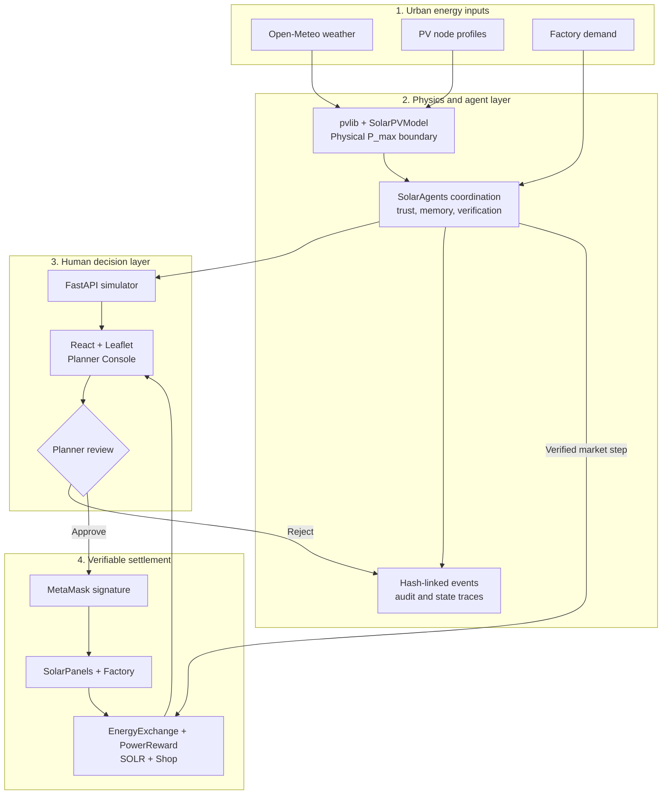
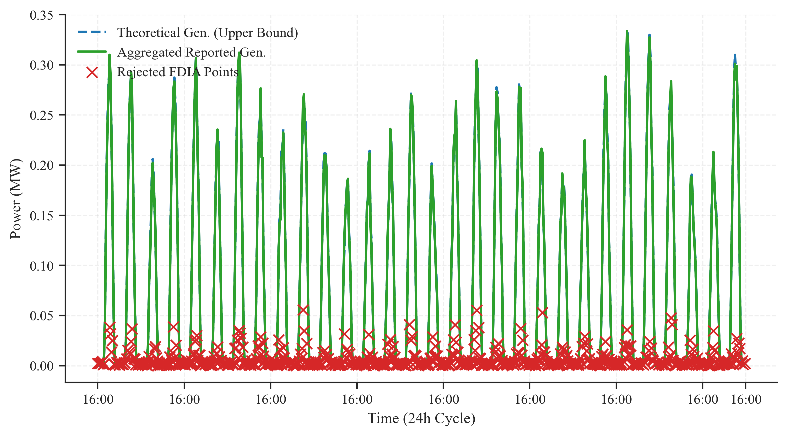
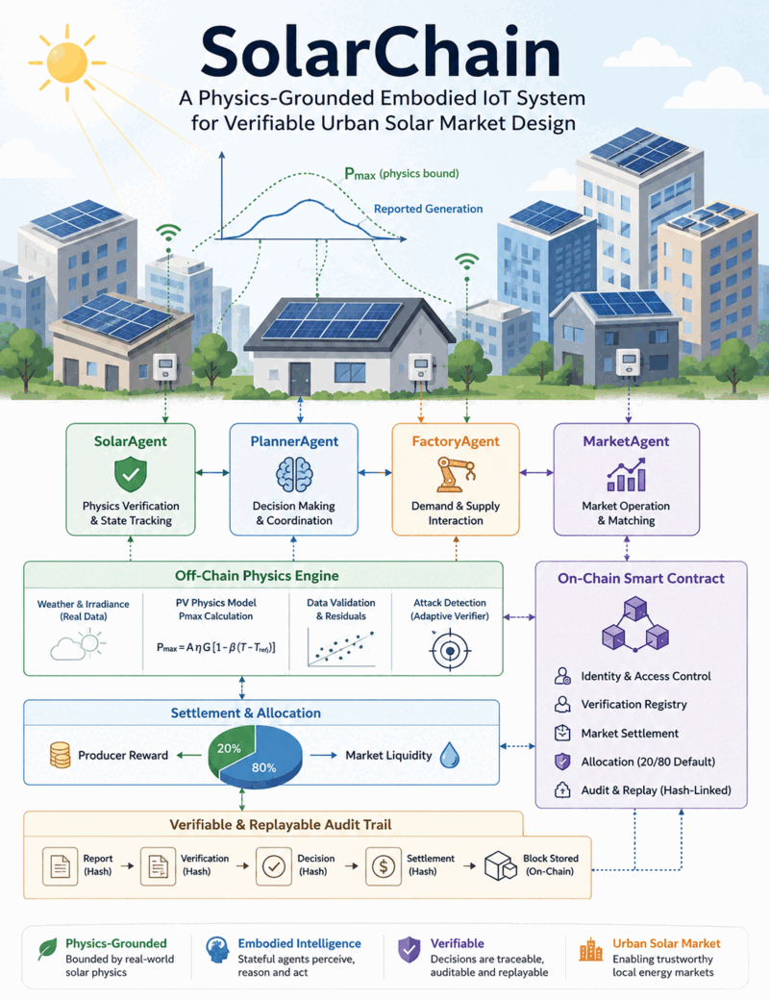

<div align="center">
  

  <h1>☀️ SolarChain</h1>

  <p><strong>Physics-grounded embodied IoT for verifiable urban solar markets</strong></p>
  <p>
    From weather-aware PV modeling and FDIA detection to human review,
    wallet-signed registration, and blockchain-backed energy settlement.
  </p>

  <p>
    <a href="docs/camera_ready_release.md">
      
    </a>
    <a href="LICENSE">
      
    </a>
    <a href="https://github.com/sunshineluyao/SolarSave/commits/main">
      
    </a>
    <a href="https://github.com/sunshineluyao/SolarSave/issues">
      
    </a>
  </p>

  <p>
    
    
    
    
    
  </p>

  <p>
    <a href="#architecture">Architecture</a> •
    <a href="#quick-start">Quick Start</a> •
    <a href="#research-artifact">Research Artifact</a> •
    <a href="#smart-contracts">Contracts</a> •
    <a href="#documentation">Documentation</a>
  </p>
</div>

> [!NOTE]
> **SolarChain** is the product and paper name. The repository remains named
> **SolarSave** for continuity with the original project.

## Overview

SolarChain is an open-source research prototype for urban distributed-energy
verification and market coordination. It connects a physics-bounded solar
simulator, embodied PV agents, a planner-facing map and review console, MetaMask,
and a local EVM contract suite into one inspectable workflow.

The machine calculates a defensible generation boundary. The planner decides
whether a candidate distributed energy resource (DER) should proceed. Approved
records are signed by a wallet and registered on-chain; rejected or anomalous
records remain visible in the audit trail.

| ☀️ **50 PV agents** | 🕒 **720 hourly steps** | 📊 **36,000 records** | 🛡️ **11 attack scenarios** |
|:---:|:---:|:---:|:---:|
| Five Chinese cities | April 2026 episode | 5% scripted FDIA | Seven detector variants |

| | |
|---|---|
| **🛰️ Physics-grounded verification**<br />Derives `P_max_W` from weather, panel geometry, efficiency, and temperature effects before evaluating reported output. | **🧑‍💻 Human-in-the-loop governance**<br />A planner reviews candidate DER records, residuals, risk state, and map context before registration. |
| **⛓️ Verifiable settlement**<br />MetaMask signs asset registration and EVM contracts track panels, factories, energy, rewards, trades, and SOLR. | **🔬 Reproducible evaluation**<br />Versioned datasets, experiment scripts, hash-linked traces, policy sweeps, and publication figures ship with the repository. |

## Architecture

The system closes the loop between physical modeling, adaptive verification,
human judgment, and market settlement.



### Verification to Settlement

1. **Observe:** weather and node metadata drive a bounded PV generation model.
2. **Verify:** agent policies compare `P_reported_W` with the physical boundary
   and update trust, calibration, and verification state.
3. **Review:** the planner inspects the candidate queue, map context, residuals,
   and FDIA status.
4. **Sign:** an approved candidate is signed through MetaMask and registered as
   an on-chain solar panel.
5. **Settle:** verified supply enters the configurable reward/liquidity market,
   where factories purchase energy and rewards accrue.
6. **Audit:** event, decision, market, and state records form reproducible,
   hash-linked traces.

## Research Snapshot

<table>
  <tr>
    <td width="50%">
      <a href="Simulator/data/visualizations/canonical_04_china_urban_energy_map.png">
        
      </a>
    </td>
    <td width="50%">
      <a href="Simulator/data/visualizations/reviewer_a_generation_vs_reported_fdia.png">
        
      </a>
    </td>
  </tr>
  <tr>
    <td align="center"><sub><strong>Five-city embodied PV network</strong></sub></td>
    <td align="center"><sub><strong>Physics-bounded FDIA verification</strong></sub></td>
  </tr>
</table>

The bundled benchmark is a reproducible, weather-driven simulation over
Beijing, Chengdu, Hangzhou, Shanghai, and Shenzhen. It uses city-level
Open-Meteo observations, `pvlib` solar modeling, synthetic PV node profiles,
scripted false-data injection, and controlled market construction.

<p align="center">
  <a href="docs/camera_ready_release.md">
    
  </a>
  <a href="docs/eiot_evaluation_artifacts.md">
    
  </a>
  <a href="Simulator/data/datasets_2026_04_month/dataset_provenance.json">
    
  </a>
</p>

## Quick Start

### Prerequisites

- Node.js 18+ and npm
- Python 3.9+
- Git
- MetaMask for wallet-signed interactions

### 1. Clone

```bash
git clone https://github.com/sunshineluyao/SolarSave.git
cd SolarSave
```

### 2. Start the Local Chain

```bash
cd smart_contract
npm install
npx hardhat node
```

Keep the Hardhat node running. In a second terminal, deploy the contracts:

```bash
cd smart_contract
npx hardhat run scripts/deployAll.js --network localhost
```

The deployment script authorizes the contract relationships, funds local test
accounts, and synchronizes contract addresses with the frontend and simulator.

### 3. Start the Simulator

```bash
cd Simulator
python -m venv .venv
source .venv/bin/activate
pip install -r requirements.txt
python -m uvicorn main:app --reload
```

The API is available at <http://127.0.0.1:8000>; interactive API documentation
is available at <http://127.0.0.1:8000/docs>.

### 4. Start the Planner Console

```bash
cd client
npm install
npm run dev
```

Open <http://127.0.0.1:3000> and connect MetaMask to:

| Setting | Local value |
|---|---|
| RPC URL | `http://127.0.0.1:8545` |
| Chain ID | `31337` |
| Network | Hardhat Local |

> [!CAUTION]
> Import only a Hardhat test key for local development. Never commit private
> keys or use a production wallet with the local prototype.

## Research Artifact

The camera-ready artifact centers on the April 2026 controlled benchmark and
the EIoT evaluation suite.

| Artifact | Scale | Purpose |
|---|---:|---|
| [PV node metadata](Simulator/data/datasets_2026_04_month/urban_energy_nodes.csv) | 50 nodes | Five-city panel geometry and installation profiles |
| [Hourly generation](Simulator/data/datasets_2026_04_month/spatiotemporal_generation.csv) | 36,000 rows | Physical bounds, reports, FDIA labels, and decisions |
| [Market liquidity](Simulator/data/datasets_2026_04_month/market_liquidity.csv) | 720 rows | Selected 20/80 reward-liquidity policy vs. baseline |
| [P2P trades](Simulator/data/datasets_2026_04_month/p2p_trades.csv) | 1,185 trades | Factory purchases, token burn, and exergy estimates |
| [Attack taxonomy](Simulator/data/experiments/attack_taxonomy_results.csv) | 11 scenarios | Detector behavior across physical and contextual attacks |
| [Event-chain verification](Simulator/data/experiments/event_chain_verification.csv) | Hash checks | Tamper-evident trace validation |
| [Ratio selection](Simulator/data/experiments/ratio_selection_summary.csv) | Policy summary | Evidence for the default `rewardRatioBps = 2000` |

### Reproduce the Artifacts

Run from the repository root after installing the simulator dependencies:

```bash
python Simulator/data/generate_monthly_datasets.py
python Simulator/experiments/run_all_eiot_experiments.py
python Simulator/data/visualizations.py
```

### Validate the Release

```bash
python -m pytest tests
```

```bash
cd smart_contract
npm test
```

```bash
cd client
npm run build
```

## Smart Contracts

| Contract | Responsibility |
|---|---|
| [`SolarPanels.sol`](smart_contract/contracts/SolarPanels.sol) | Solar asset registry, ownership, and panel state |
| [`Factory.sol`](smart_contract/contracts/Factory.sol) | Factory registration and demand-side entities |
| [`EnergyExchange.sol`](smart_contract/contracts/EnergyExchange.sol) | Supply, demand, configurable reward allocation, claims, and purchases |
| [`SolarToken.sol`](smart_contract/contracts/SolarToken.sol) | ERC-20 SOLR payment and reward token |
| [`Shop.sol`](smart_contract/contracts/Shop.sol) | Solar-panel marketplace operations |
| [`PowerReward.sol`](smart_contract/contracts/PowerReward.sol) | DC-power-linked reward distribution |

The default market allocation is **20% producer reward / 80% liquidity**,
represented on-chain as `rewardRatioBps = 2000`.

## API Surface

| Endpoint | Method | Purpose |
|---|---|---|
| `/run_model/` | POST | Run the PV prediction model |
| `/run_combined_model/` | POST | Combine solar prediction inputs |
| `/agents/status` | GET | Inspect the current embodied-agent loop |
| `/agents/step` | POST | Execute one coordination step |
| `/agents/run_episode` | POST | Run a configured agent episode |
| `/agents/events` | GET | Read recent agent events |
| `/agents/audit` | GET | Inspect audit events |
| `/agents/market_summary` | GET | Read market-level results |
| `/agents/settle_verified_step` | POST | Submit a verified market step for settlement |

## Project Map

| Path | What lives there |
|---|---|
| [`client/`](client) | React, Leaflet, planner console, market views, and wallet interactions |
| [`Simulator/`](Simulator) | FastAPI service, PV physics model, agents, datasets, and experiments |
| [`smart_contract/`](smart_contract) | Solidity contracts, Hardhat deployment scripts, and contract tests |
| [`tests/`](tests) | Research-artifact and embodied-agent evaluation tests |
| [`docs/`](docs) | Release record, evaluation map, and supporting research documentation |

## Configuration

| Variable | Default | Purpose |
|---|---|---|
| `SIMULATOR_RPC_URL` | `http://127.0.0.1:8545` | EVM JSON-RPC endpoint |
| `SIMULATOR_PRIVATE_KEY` | unset | Local signer used for simulator settlement |
| `SIMULATOR_STEP_SECONDS` | `3600` | Coordination and market-step interval |
| `ENABLE_ENERGY_SIM` | `auto` | Enable, disable, or auto-detect settlement |
| `SIMULATOR_CORS_ORIGINS` | local frontend origins | Allowed simulator API origins |
| `VITE_SOLAR_AGENT_API` | `http://localhost:8000` | Frontend simulator API base URL |
| `VITE_URBAN_DATASET_DIR` | bundled public dataset | Frontend CSV dataset directory |

## Documentation

| Guide | Description |
|---|---|
| [Camera-ready release record](docs/camera_ready_release.md) | Publication identity, checksum, artifact map, and scope |
| [EIoT evaluation artifacts](docs/eiot_evaluation_artifacts.md) | Claims-to-evidence map for datasets and experiments |
| [Dataset documentation](Simulator/data/README.md) | Dataset organization, fields, and generation workflow |
| [Simulator guide](Simulator/README.md) | API and model-specific setup |
| [Contract guide](smart_contract/README.md) | Contract deployment and interaction notes |

<details>
<summary><strong>Common troubleshooting</strong></summary>

- **No contracts in the UI:** deploy with `deployAll.js` after starting the
  Hardhat node, then confirm the generated address files were updated.
- **Empty candidate queue:** confirm
  `client/public/datasets_2026_04_month/spatiotemporal_generation.csv` exists.
- **Only 50 map markers:** expected; 36,000 hourly records are grouped by
  `node_id` into 50 locations.
- **Simulator cannot settle:** check `SIMULATOR_RPC_URL`,
  `SIMULATOR_PRIVATE_KEY`, and `ENABLE_ENERGY_SIM`.
- **Rewards stay at zero:** run at least one simulator market step and ensure the
  reward contract has been funded with local SOLR.

</details>

## Scope and Limitations

> [!IMPORTANT]
> SolarChain is a **controlled research prototype**, not a utility deployment.
> Weather is city-level rather than per-panel telemetry; PV nodes, FDIA labels,
> demand, and trades are simulated for benchmark control. The repository does
> not claim production readiness, sensor authenticity, economic optimality, or
> a completed smart-contract security audit.

## Publication

This repository is the final artifact release for:

> **SolarChain: A Physics-Grounded Embodied IoT System for Verifiable Urban Solar Market Design**<br />
> UbiComp Companion '26, Shanghai, China

See the [camera-ready release record](docs/camera_ready_release.md) for the paper
checksum and the [evaluation artifact map](docs/eiot_evaluation_artifacts.md)
for reproducibility links.

## Contributing

Contributions are welcome:

1. Fork the repository.
2. Create a focused branch.
3. Add or update tests for behavioral changes.
4. Open a pull request describing the motivation, implementation, and evidence.

For questions or proposals, [open a GitHub issue](https://github.com/sunshineluyao/SolarSave/issues).

## License

SolarChain is released under the [MIT License](LICENSE).


<div align="center">
  <sub>Built for inspectable solar-energy coordination, from physical evidence to verifiable settlement.</sub>
    <p>
    
    &nbsp;&nbsp;
    
  </p>
</div>
